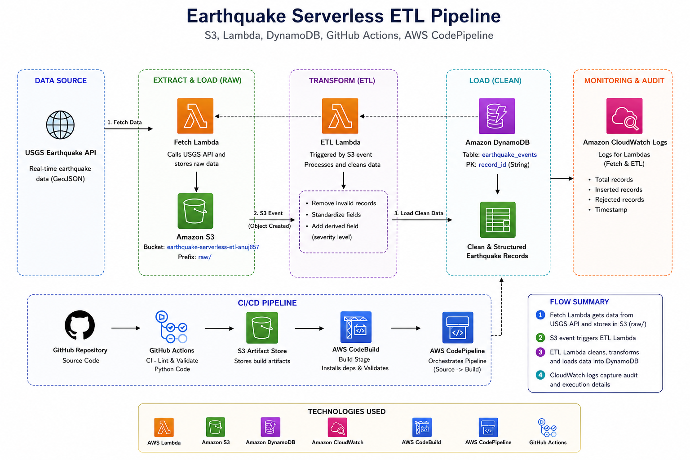

# 🚀 Serverless Event-Driven ETL Pipeline on AWS

<p align="center">
  
</p>

<p align="center">


</p>

## 📖 Overview

This project demonstrates a **production-style Serverless Event-Driven ETL Pipeline** built entirely on AWS.

The pipeline extracts data from multiple public APIs, uploads raw JSON files into **Amazon S3**, automatically triggers **AWS Lambda** for transformation and validation, and stores the cleaned records in **Amazon DynamoDB**.

The entire project is integrated with **GitHub Actions** and **AWS CodePipeline** to automatically validate code changes and support continuous integration.

---

# ✨ Features

- Fully Serverless Architecture
- Event-Driven ETL Pipeline
- Multiple Data Sources
- Automatic S3 Event Trigger
- Data Cleaning & Validation
- DynamoDB Storage
- CloudWatch Monitoring
- GitHub Actions CI
- AWS CodePipeline
- AWS CodeBuild Validation
- Production-ready Folder Structure

---

# 🏗 AWS Services Used

| Service | Purpose |
|----------|----------|
| Amazon S3 | Store raw JSON files |
| AWS Lambda | Transform & Validate data |
| Amazon DynamoDB | Store cleaned records |
| Amazon CloudWatch | Logs & Monitoring |
| AWS IAM | Permissions |
| GitHub Actions | Continuous Integration |
| AWS CodePipeline | Deployment Pipeline |
| AWS CodeBuild | Build & Validation |

---

# 📂 Project Structure

```
serverless-etl-pipeline/
│
├── docs/
│   ├── architecture.png
│   ├── lambda.png
│   ├── s3.png
│   ├── dynamodb.png
│   ├── cloudwatch.png
│   ├── codepipeline.png
│   └── github-actions.png
│
├── sample_data/
│
├── lambda/
│   ├── earthquake/
│   ├── weather/
│   └── products/
│
├── .github/
│   └── workflows/
│
├── fetch_data.py
├── buildspec.yml
├── requirements.txt
└── README.md
```

---

# 🔄 ETL Workflow

```
Public APIs
      │
      ▼
Python Fetch Script
      │
      ▼
Amazon S3
      │
      ▼
S3 ObjectCreated Event
      │
      ▼
AWS Lambda
      │
      ▼
Validation & Transformation
      │
      ▼
Amazon DynamoDB
      │
      ▼
CloudWatch Logs
```

---

# 📊 Data Sources

| Dataset | API |
|----------|-----|
| 🌍 Earthquake | USGS API |
| 🌦 Weather | Open-Meteo API |
| 🛒 Products | DummyJSON API |

---

# 🚀 CI/CD Pipeline

```
GitHub
     │
     ▼
GitHub Actions
     │
     ▼
AWS CodePipeline
     │
     ▼
AWS CodeBuild
     │
     ▼
Deployment Validation
```

---

# 📸 Project Screenshots

## 🏗 Architecture


---

## 📦 Amazon S3 Bucket


---

## ⚡ AWS Lambda Functions


---

## 🗄 DynamoDB Tables


---

## 📊 CloudWatch Logs


---

## 🚀 AWS CodePipeline


---

## ✅ GitHub Actions


---

# ▶️ Run Locally

Clone the repository

```bash
git clone https://github.com/yourusername/serverless-etl-pipeline.git
```

Move into project

```bash
cd serverless-etl-pipeline
```

Install dependencies

```bash
pip install -r requirements.txt
```

Fetch sample data

```bash
python fetch_data.py
```

Upload generated JSON files to the configured Amazon S3 bucket to trigger the ETL pipeline.

---

# 📈 Future Improvements

- AWS Step Functions
- SNS Notifications
- Dead Letter Queue (DLQ)
- Terraform Infrastructure
- AWS Glue Integration
- Redshift Data Warehouse
- Unit Testing
- Monitoring Dashboard

---

# 🛠 Tech Stack

- Python 3.12
- AWS Lambda
- Amazon S3
- Amazon DynamoDB
- AWS IAM
- Amazon CloudWatch
- GitHub Actions
- AWS CodePipeline
- AWS CodeBuild
- JSON
- Requests

---

# 👨‍💻 Author

**Anuj Kumar Yadav**

B.Tech Computer Science Engineering

Data Engineering Enthusiast

GitHub: https://github.com/Anuj857

---

## ⭐ If you found this project helpful, consider giving it a Star!